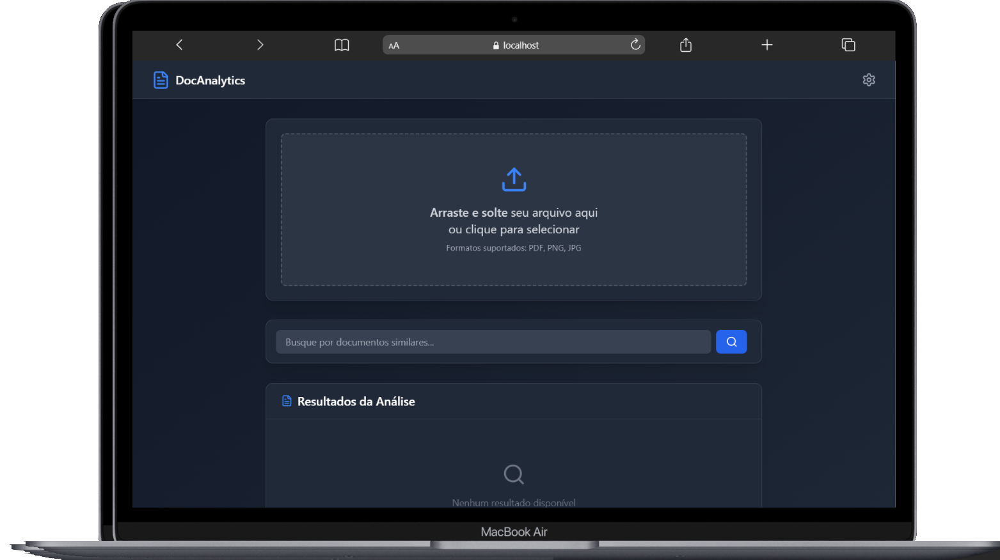

# DocAnalytics - Frontend

Aplicação web moderna para análise inteligente de documentos com OCR, IA e busca semântica. Permite extrair, analisar e buscar documentos de forma eficiente.

## 🌟 Características

- 📄 **Extração de Texto (OCR)** - Reconhecimento automático de conteúdo em PDFs, PNG e JPG
- 🤖 **Análise com IA** - Processamento inteligente usando OpenAI
- 🔍 **Busca Semântica** - Encontre documentos similares usando banco vetorial
- 💻 **Interface Responsiva** - Design moderno dark mode com UX otimizada
- 🚀 **Performance** - Vite para build ultrarrápido
- 🐳 **Containerização Docker** - Deploy simplificado

## 🛠️ Stack Tecnológico

| Tecnologia | Versão | Uso |
|-----------|--------|-----|
| React | 18.3.1 | Framework UI |
| TypeScript | 5.5.3 | Tipagem estática |
| Vite | 5.4.2 | Build tool |
| Tailwind CSS | 3.4.1 | Styling |
| Axios | 1.6.7 | Requisições HTTP |
| React Toastify | 11.0.5 | Notificações |
| Lucide React | 0.344.0 | Ícones |
| ESLint | 9.9.1 | Linting |

## 📋 Pré-requisitos

- Node.js 18+ 
- npm ou yarn
- Docker e Docker Compose (opcional)

## ⚙️ Instalação

### Localmente

```bash
# Clonar o repositório
git clone https://github.com/seu-usuario/docanalytics-frontend.git
cd docanalytics-frontend

# Instalar dependências
npm install

# Iniciar servidor de desenvolvimento
npm run dev
```

A aplicação estará disponível em `http://localhost:5173`

### Com Docker

```bash
# Build e rodar com Docker Compose
docker-compose up --build

# Apenas rodar (se já foi buildado)
docker-compose up
```

## 📚 Scripts Disponíveis

```bash
# Desenvolvimento
npm run dev          # Inicia servidor Vite em modo desenvolvimento

# Produção
npm run build        # Build otimizado para produção
npm run preview      # Preview do build de produção

# Qualidade de Código
npm run lint         # Executa ESLint em todos os arquivos
```

## 📁 Estrutura do Projeto

```
.
├── src/
│   ├── App.tsx              # Componente principal
│   ├── main.tsx             # Ponto de entrada
│   ├── index.css            # Estilos globais
│   └── assets/              # Imagens e recursos
├── public/                  # Arquivos estáticos
├── index.html               # HTML principal
├── package.json             # Dependências
├── tsconfig.json            # Config TypeScript
├── vite.config.ts           # Config Vite
├── tailwind.config.js       # Config Tailwind
├── postcss.config.js        # Config PostCSS
├── eslint.config.js         # Config ESLint
├── Dockerfile               # Imagem Docker
├── docker-compose.yml       # Orquestração Docker
└── .gitignore               # Arquivos ignorados
```

## 🔌 Integração com Backend

A aplicação conecta-se ao backend FastAPI hospedado no Render:

```
https://docanalytcs-backend.onrender.com
```

### Endpoints Utilizados

| Método | Endpoint | Descrição |
|--------|----------|-----------|
| POST | `/api/analyze` | Analisa documento enviado |
| POST | `/api/search` | Busca documentos similares |
| GET | `/api/health` | Verifica saúde do backend |

**Nota**: Backend é pingado a cada 5 minutos para manter a aplicação ativa.

## 🎯 Funcionalidades Principais

### 1. Upload e Análise de Documentos

```tsx
// Suporta: PDF, PNG, JPG
// Extrai texto via OCR
// Analisa com IA (OpenAI)
// Retorna confiança da análise
```

- Drag & drop ou clique para selecionar
- Feedback em tempo real durante processamento
- Exibição de resultados com score de confiança

### 2. Busca Semântica

```tsx
// Busca por documentos similares
// Usa embeddings vetoriais
// Retorna top 5 resultados
// Exibe score de similaridade
```

- Campo de busca inteligente
- Resultados ordenados por relevância
- Informações do documento (filename, tipo, tamanho, timestamp)

### 3. Visualização de Resultados

- Cards com categorização (Texto Extraído / Análise AI)
- Indicador visual de confiança
- Sintaxe de código com destaque
- Navegação intuitiva

## 🐛 Tratamento de Erros

A aplicação implementa:

- ✅ Validação de formatos suportados
- ✅ Tratamento de erros de upload
- ✅ Feedback visual via Toast notifications
- ✅ Logs de console para debug
- ✅ Health check automático do backend

## 🎨 Personalização

### Cores do Tema

Edite `tailwind.config.js` para customizar:

```js
theme: {
  extend: {
    colors: {
      // suas cores aqui
    }
  }
}
```

### Estilos Globais

Modifique `src/index.css` para adicionar estilos customizados.

## 🚀 Deploy

### Deploy no Render/Vercel

```bash
# Build de produção
npm run build

# Arquivos gerados em: ./dist
```

Configure a variável de ambiente:
- `VITE_API_URL` - URL base da API backend

### Variáveis de Ambiente

Crie `.env.local`:

```env
VITE_API_URL=https://seu-backend.com
```

## 📊 Performance

- ⚡ Vite oferece HMR (Hot Module Replacement)
- 📦 Otimizações de bundle automáticas
- 🎯 Tree-shaking habilitado
- 🔄 Lazy loading de componentes (configurável)

## 🔐 Segurança

- ✅ TypeScript para type safety
- ✅ ESLint com regras estritas
- ✅ CORS configurado no backend
- ✅ Validação de inputs

## 📝 Convenções de Código

- Componentes em `PascalCase` (.tsx)
- Interfaces com `I` prefix
- Props tipadas corretamente
- Comentários em português/inglês

## 🤝 Contribuindo

1. Fork o repositório
2. Crie uma branch para sua feature (`git checkout -b feature/AmazingFeature`)
3. Commit suas mudanças (`git commit -m 'Add AmazingFeature'`)
4. Push para a branch (`git push origin feature/AmazingFeature`)
5. Abra um Pull Request

## 📄 Licença

Este projeto está sob a licença MIT. Veja o arquivo `LICENSE` para mais detalhes.

## 👨‍💻 Autor

Desenvolvido por [Seu Nome/Time]

## 📞 Suporte

Para suporte e dúvidas:
- Linkedin: [GitHub Issues](https://github.com/AgnaldoFelix)

